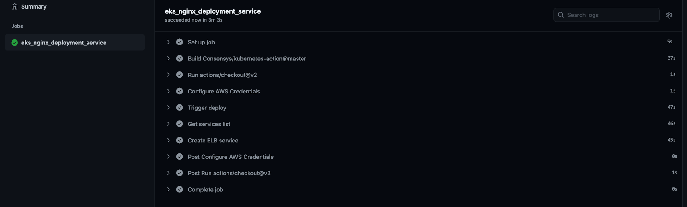

# How to Deploy an Application and Create a Service on an AWS EKS Kubernetes Cluster with Manual and GitOps Approaches


This repo shows how to deploy and modify the application [nginx](https://www.nginx.com/) on an [AWS EKS Kubernetes cluster](https://github.com/apprenticecto/how-to-create-a-kubernetes-cluster-on-aws-eks-with-terraform) and create a Service, both using a (preferred) GitOps based approach and manually.

An EKS cluster must be already set-up and kubectl needs to be already configured. See [my repo](https://github.com/apprenticecto/how-to-create-a-kubernetes-cluster-on-aws-eks-with-terraform) to set-up an AWS EKS cluster and enable kubectl.

**Please consider that AWS will [charge you](https://aws.amazon.com/eks/pricing/) for your EKS cluster, regardless of your eligibility for the [free-tier program](https://aws.amazon.com/free/).** 

# Manual Approach

#### Deploy Nginx App

[Disable](https://docs.github.com/en/free-pro-team@latest/actions/managing-workflow-runs/disabling-and-enabling-a-workflow) the `.github/workflows` folder, so to prevent the defined [github action](https://docs.github.com/en/free-pro-team@latest/actions) to run on each push and manage your deployments manually. See [Gitops approach section](#GitOps).

First of all, we have to define our nginx [deployment on k8s](https://kubernetes.io/docs/concepts/workloads/controllers/deployment/) by entering `kubectl apply -f nginx_deployment.yaml`, where:

- a deployment named `nginx-deployment` is created, indicated by the `.metadata.name` field;
- the deployment creates the number of replicated Pods indicated in the `.spec.replicas` field;
- the `.spec.selector` field defines how the deployment finds which Pods to manage by setting a label that is defined in the Pod template (`app: nginx`)
- the template field contains the following sub-fields:

    - the Pods are labeled `app: nginx` using the `.metadata.labels field;
    - the Pod template's specification, or `.template.spec` field, indicates that the Pods run one container, nginx, which runs the nginx [Docker Hub](https://hub.docker.com/_/nginx) image with the stated version;
    - one container is created and named `nginx` using the `.spec.template.spec.containers[0].name` field
    - nginx container is exposed through port 80 only.

Now run `kubectl get deployments` to check if the deployment was created; after a few seconds (retry meanwhile), you should see two replicas in `READY` state. 

Intermediate output should be similar to:
```
NAME               READY   UP-TO-DATE   AVAILABLE   AGE
nginx-deployment   0/2     2            0           4s
```

Final output should be similar to:
```
NAME               READY   UP-TO-DATE   AVAILABLE   AGE
nginx-deployment   2/2     2            2           26s
```

When you inspect the Deployments in your cluster, the following fields are displayed:

  - `NAME` lists the names of the Deployments in the namespace.
  - `READY` displays how many replicas of the application are available to your users. It follows the pattern ready/desired.
  - `UP-TO-DATE` displays the number of replicas that have been updated to achieve the desired state.
  - `AVAILABLE` displays how many replicas of the application are available to your users.
  - `AGE` displays the amount of time that the application has been running.

Notice how the number of desired replicas equals .spec.replicas field value.

To see the ReplicaSet (rs) created by the deployment, run `kubectl get rs`. This should match with the configuration defined in your deployment yaml file (`.spec.replicas` field). The output should be similar to:
```
NAME                         DESIRED   CURRENT   READY   AGE
nginx-deployment-7b446869f   2         2         2       2m49s
```

ReplicaSet output shows the following fields:

  - `NAME` lists the names of the ReplicaSets in the namespace.
  - `DESIRED` displays the desired number of replicas of the application, which you define when you create the Deployment. This is the desired state.
  - `CURRENT` displays how many replicas are currently running.
  - `READY` displays how many replicas of the application are available to your users.
  - `AGE` displays the amount of time that the application has been running.

Notice that the name of the ReplicaSet is always formatted as [DEPLOYMENT-NAME]-[RANDOM-STRING]. The random string is randomly generated and uses the pod-template-hash as a seed.

Run `kubectl get pods`; you should get an output similar to, with the number of pods equalling replicas number (two in this case):
```
NAME                                READY   STATUS    RESTARTS   AGE
nginx-deployment-75ddd4d4b4-d4f2s   1/1     Running   0          17s
nginx-deployment-75ddd4d4b4-s298s   1/1     Running   0          17s
```

To get Pods IPs, enter `kubectl get pods -l 'app=nginx' -o wide | awk {'print $1" " $3 " " $6'} | column -t`; the output should be similar to:
```
NAME                               READY   STATUS    RESTARTS   AGE
nginx-deployment-7b446869f-44lv8   1/1     Running   0          2m11s
nginx-deployment-7b446869f-w4d4q   1/1     Running   0          2m11s
```

To see the labels automatically generated for each Pod, run `kubectl get pods --show-labels`. The output should be similar to:
```
NAME                               READY   STATUS    RESTARTS   AGE     LABELS
nginx-deployment-7b446869f-44lv8   1/1     Running   0          3m40s   app=nginx,pod-template-hash=7b446869f
nginx-deployment-7b446869f-w4d4q   1/1     Running   0          3m40s   app=nginx,pod-template-hash=7b446869f
```

#### Change Replica Sets

You can scale a Deployment by using the following command: `kubectl scale deployment.v1.apps/nginx-deployment --replicas=3`

The output is similar to:
```
deployment.apps/nginx-deployment scaled
```

Then launch `kubectl get pods` to check that the number of Pods varies accordingly.

The same approach can be used to reduce the number of replicas.

Alternatively, you can edit the Deployment entering `kubectl edit deployment.v1.apps/nginx-deployment` and change `.spec.template.spec.replicas`.

#### Change APP Version

Now let's put a more significan change into our deployment: we'll update the nginx container version to 1.19.0. Run the command `kubectl set image deployment/nginx-deployment nginx=nginx:1.19.0 --record`.

Alternatively, you can edit the Deployment by entering `kubectl edit deployment.v1.apps/nginx-deployment` and change `.spec.template.spec.containers[0].image`. Also update the `Annotation.kubernetes.io/change-cause` field (see later about rollout history).

Then run `kubectl get deployments` to check that the rollout succeeds and then run `kubectl get rs` to see that the Deployment updated the Pods by creating a new ReplicaSet and scaling it up to the configured replicas, as well as scaling down the old ReplicaSet to 0 replicas.

During the rollout, you can run the command `kubectl rollout status deployment/nginx-deployment` to check the rollout status.

Please note that the rollout [strategy](https://kubernetes.io/docs/concepts/workloads/controllers/deployment/#strategy) is dependent on the following parameters: `RollingUpdateStrategy:  25% max unavailable, 25% max surge` (default values). They drive how new pods are scaled up and how old ones are scaled-down. 

You can see (anandche change) these values by entering: `kubectl edit deployment.v1.apps/nginx-deployment`.

More specifically:

- `Max Surge` `(.spec.strategy.rollingUpdate.maxSurge`) is an optional field that specifies the maximum % of Pods (25% by default) that can be created over the desired number of Pods;
- `Max Unavailable` (`.spec.strategy.rollingUpdate.maxUnavailable`) is an optional field that specifies the maximum % of Pods (default 25%) that can be unavailable during the update process.

Run `kubectl get pods` to show the new Pods.

The command `kubectl describe deployments` gives more details about how the change was applied. The output should be similar to:
```
Name:                   nginx-deployment
Namespace:              default
CreationTimestamp:      Wed, 06 Jan 2021 00:39:00 +0100
Labels:                 app=nginx
Annotations:            deployment.kubernetes.io/revision: 2
                        kubernetes.io/change-cause: lower version from 1.19.0 to 1.18.00
Selector:               app=nginx
Replicas:               2 desired | 2 updated | 2 total | 2 available | 0 unavailable
StrategyType:           RollingUpdate
MinReadySeconds:        0
RollingUpdateStrategy:  25% max unavailable, 25% max surge
Pod Template:
  Labels:  app=nginx
  Containers:
   nginx:
    Image:        nginx:1.18.0
    Port:         80/TCP
    Host Port:    0/TCP
    Environment:  <none>
    Mounts:       <none>
  Volumes:        <none>
Conditions:
  Type           Status  Reason
  ----           ------  ------
  Available      True    MinimumReplicasAvailable
  Progressing    True    NewReplicaSetAvailable
OldReplicaSets:  <none>
NewReplicaSet:   nginx-deployment-75ddd4d4b4 (2/2 replicas created)
Events:
  Type    Reason             Age    From                   Message
  ----    ------             ----   ----                   -------
  Normal  ScalingReplicaSet  36m    deployment-controller  Scaled up replica set nginx-deployment-7b446869f to 2
  Normal  ScalingReplicaSet  18m    deployment-controller  Scaled up replica set nginx-deployment-7b446869f to 3
  Normal  ScalingReplicaSet  17m    deployment-controller  Scaled down replica set nginx-deployment-7b446869f to 2
  Normal  ScalingReplicaSet  7m48s  deployment-controller  Scaled up replica set nginx-deployment-75ddd4d4b4 to 1
  Normal  ScalingReplicaSet  7m40s  deployment-controller  Scaled down replica set nginx-deployment-7b446869f to 1
  Normal  ScalingReplicaSet  7m40s  deployment-controller  Scaled up replica set nginx-deployment-75ddd4d4b4 to 2
  Normal  ScalingReplicaSet  7m32s  deployment-controller  Scaled down replica set nginx-deployment-7b446869f to 0
```

You'll notice that this change increased the revision number (`Annotation.deployment.kubernetes.io/revision` field).

To check a revision, enter the following command: `kubectl rollout history deployment.v1.apps/nginx-deployment`: the `CHANGE-CAUSE` info comes from the `Annotation.kubernetes.io/change-cause` field. 

This value can be also entered by running `kubectl annotate deployment.v1.apps/nginx-deployment kubernetes.io/change-cause="<your CHANGE-CAUSE text>"`.

To see the details of each revision, run: `kubectl rollout history deployment.v1.apps/nginx-deployment --revision=2`.

#### Rolling Back a Deployment

A rollback can be just considered as an APP change or specifically entered: `kubectl rollout undo deployment.v1.apps/nginx-deployment`; a specific revision can be stated: `kubectl rollout undo deployment.v1.apps/nginx-deployment --to-revision=2`.

Again, the same result can be obtained by entering: `kubectl edit deployment.v1.apps/nginx-deployment`.

To check if the rollback was successful and the Deployment is running as expected, run: `kubectl get deployment nginx-deployment` and get the description of the deployment: `kubectl describe deployment nginx-deployment`.

#### Define and Expose Service

To expose our application, we define a service called `nginx-service` and expose it via an [AWS ELB](https://aws.amazon.com/elasticloadbalancing/?sc_channel=PS&sc_campaign=acquisition_IT&sc_publisher=google&sc_medium=english_load_balancing_b&sc_content=aws_load_balancer_e&sc_detail=aws%20load%20balancer&sc_category=load_balancing&sc_segment=162172415977&sc_matchtype=e&sc_country=IT&s_kwcid=AL!4422!3!162172415977!e!!g!!aws%20load%20balancer&ef_id=Cj0KCQiA0MD_BRCTARIsADXoopY7h6qZ9AjCoeJaaI1YYFOEO-XVH-naFJi62jchzfG4K57S3qiQuIAaAmJZEALw_wcB:G:s&s_kwcid=AL!4422!3!162172415977!e!!g!!aws%20load%20balancer&elb-whats-new.sort-by=item.additionalFields.postDateTime&elb-whats-new.sort-order=desc).

Run the following command: `kubectl create -f nginx_loadbalancer.yaml`. The output is simply `service/nginx-service created`.

To get information about nginx-service, run the following command: `kubectl get service/nginx-service |  awk {'print $1" " $2 " " $4 " " $5'} | column -t`.

The output is similar to:
```
NAME           TYPE          EXTERNAL-IP                                                                 PORT(S)
nginx-service  LoadBalancer  *****.eu-central-1.elb.amazonaws.com  80:30645/TCP
```

To verify that you can access the load balancer externally, run the following command: `curl -silent *****.eu-central-1.elb.amazonaws.com:80`, where the `*****.eu-central-1.elb.amazonaws.com:80` is the "External IP" portion of the previous command output.

If everything is ok, you should see the contents of the Nginx welcome page.
```
<!DOCTYPE html>
<html>
<head>
<title>Welcome to nginx!</title>
<style>
    body {
        width: 35em;
        margin: 0 auto;
        font-family: Tahoma, Verdana, Arial, sans-serif;
    }
</style>
</head>
<body>
<h1>Welcome to nginx!</h1>
<p>If you see this page, the nginx web server is successfully installed and
working. Further configuration is required.</p>

<p>For online documentation and support please refer to
<a href="http://nginx.org/">nginx.org</a>.<br/>
Commercial support is available at
<a href="http://nginx.com/">nginx.com</a>.</p>

<p><em>Thank you for using nginx.</em></p>
</body>
</html>
```


# <a name="GitOps"></a>GitOps Approach

[GitOps](https://www.weave.works/technologies/gitops/) approach is based on using [Git](https://git-scm.com/) as a single source of truth for declarative infrastructure and applications.

We'll use this approach to manage our nginx deployments, and service exposure through a Github action, acting as [continuous deployments]](https://www.atlassian.com/continuous-delivery/continuous-deployment) platform. 

Please [enable](https://docs.github.com/en/free-pro-team@latest/actions/managing-workflow-runs/disabling-and-enabling-a-workflow) (if disabled) the `.github/workflows` folder, so to let the defined [github action](https://docs.github.com/en/free-pro-team@latest/actions) run on each push.

The action deploys nginx app and defines the `nginx-service` on push to remote, simply by committing a new version of the `nginx_deployment.yaml` file.

You can achieve all the updates seen in the manual section by just:

- updating the deployment yaml file
- commit locally
- push the update to your Github remote repo triggering the job defined in `eks_deplpyment_action.yaml` to start.

Moreover, everything is versioned, and all the "power" of git can be leveraged. 

The workflow is very straightforward: on each push to our remote repo on Github (for instance, after a change in the number of replicas or of the container version), the action:

- applies the deployment specified in `nginx_deployment.yaml`
- creates and exposes via an ELB loadbalancer the service specified in `nginx_loadbalancer.yaml`, only if it's not already created (otherwise, we'd get an error).

#### Workflow structure

The workflow defines the following structure:

- uses `actions/checkout@v2` action to access the repo
- configure IAM AWS credentials by using `aws-actions/configure-aws-credentials@v1` action to access the account in which the EKS cluster is running (see secret paragraph below)
- uses `Consensys/kubernetes-action@master` action to [interact with the ELK cluster](https://github.com/ConsenSys/kubernetes-action)) by seeting in `args` parameter the `kubectl` commands to:
    * manage `nginx-deployment`
    * get services list
    * create `nginx-service` (by using `args` parameter), only where the `if` condition is met (i.e. nginx-service hasn't been created yet, as not appearing in services list step output).

#### Set Secrets

Github actions need [credentials](https://docs.github.com/en/free-pro-team@latest/actions/reference/encrypted-secrets) to access AWS EKS resources.

Specifically, the action interacting with the EKS cluster needs the following secrets:

- `KUBE_CONFIG_DATA` (base 64 representation), obtained by running the command `cat $HOME/.kube/config | base64`
- `AWS_ACCESS_KEY_ID` of an IAM user with permissions to access the cluster 
- `AWS_SECRET_ACCESS_KEY` of an IAM user with permissions to access the cluster.

The above secrets have to be [added to your repo](https://docs.github.com/en/free-pro-team@latest/actions/reference/encrypted-secrets#creating-encrypted-secrets-for-a-repository).

#### Managing Changes

All changes discussed in the manual approach, including rollbacks, can be easily achieved by updating or moving back through the commits chain. Using the same approach you already have in place with your application software, the added value is gaining in observability, reliability, and control.

By checking the cluster's status after each change as illustrated above, you should get the same results we've seen in the manual approach.

The output of a successful run of the workflow is:

.

Ultimately, enter `kubectl get service/nginx-service |  awk {'print $1" " $2 " " $4 " " $5'} | column -t` and to verify that you can access the load balancer externally, run the following command: `curl -silent *****.eu-central-1.elb.amazonaws.com:80`, where the `*****.eu-central-1.elb.amazonaws.com:80` is the "External IP" portion of the output of the previous command.

If everything is ok, you should see the contents of the Nginx welcome page. 

# Destroy Your Scheduled APP

You can now destroy your configuration, following, in sequence, the following steps:

- delete nginx-service: enter `kubectl delete services nginx-service`
- delete nginx-deployment: enter `kubectl delete deploy/nginx-deployment`.
- destroy your EKS cluster: enter `terraform destroy` and then `yes` when required or use the `-auto-approve` option.

In case the destroy phase should get stuck, check for your loadbalancer or EC2 instances network interfaces on AWS: if still active, they could prevent further cluster destroy steps.

# Documentation

- [How do I expose the Kubernetes services running on my Amazon EKS cluster?](https://aws.amazon.com/premiumsupport/knowledge-center/eks-kubernetes-services-cluster/)
- [Kubernetes Deployments](https://kubernetes.io/docs/concepts/workloads/controllers/deployment/#revision-history-limit)
- [Connecting Applications with Services](https://kubernetes.io/docs/concepts/services-networking/connect-applications-service/)
- [Github actions documentation](https://docs.github.com/en/free-pro-team@latest/actions)
- [Github actions to deploy on EKS](https://github.com/ConsenSys/kubernetes-action)

# Authors

This repository is maintained by [ApprenticeCTO](https://github.com/apprenticecto).

# License

MIT Licensed. See LICENSE for full details.


